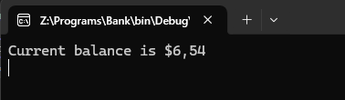

# Практическая работа №6  
## Создание автоматизированных Unit-тестов  

### Цель работы  
Провести тестирование разработанных программных модулей с использованием средств автоматизации Microsoft Visual Studio методом "белого ящика".  

