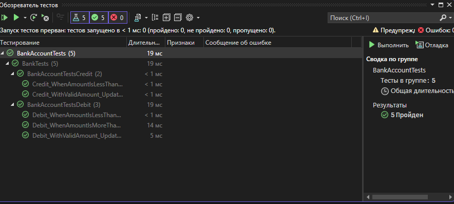

# Практическая работа №6  
## Создание автоматизированных Unit-тестов  

### Цель работы  
Провести тестирование разработанных программных модулей с использованием средств автоматизации Microsoft Visual Studio методом "белого ящика".  

#### Скриншоты результатов

### Заключение
  
Все тесты были успешно выполнены. Методы `Debit` и `Credit` работают корректно, проверка граничных условий и выброс исключений реализована правильно.  

Приложение готово к использованию, а тестирование подтвердило его стабильность и соответствие требованиям. 

